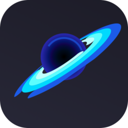
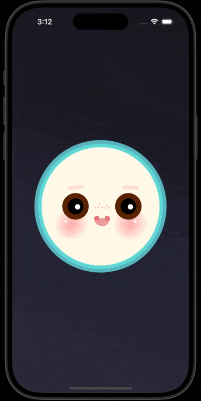
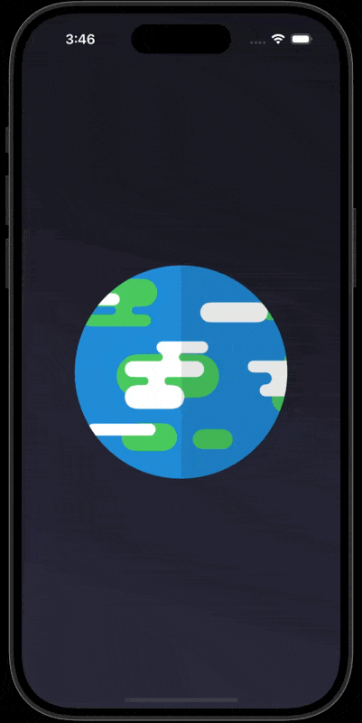
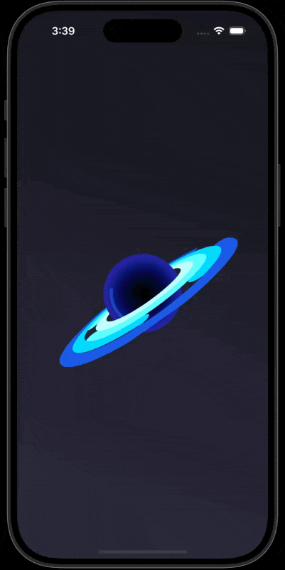
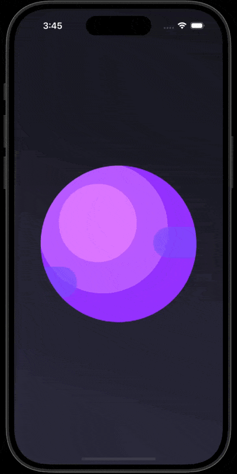
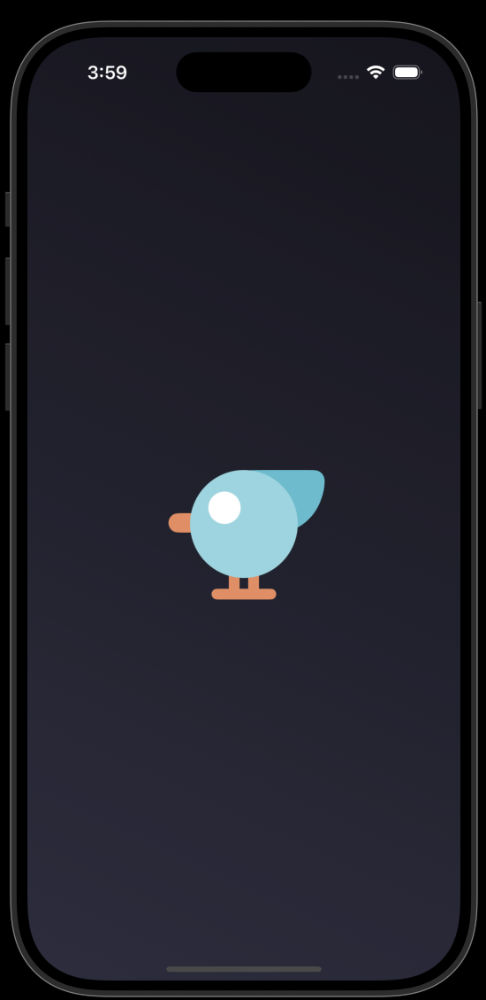
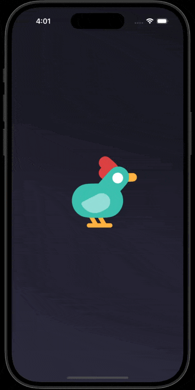
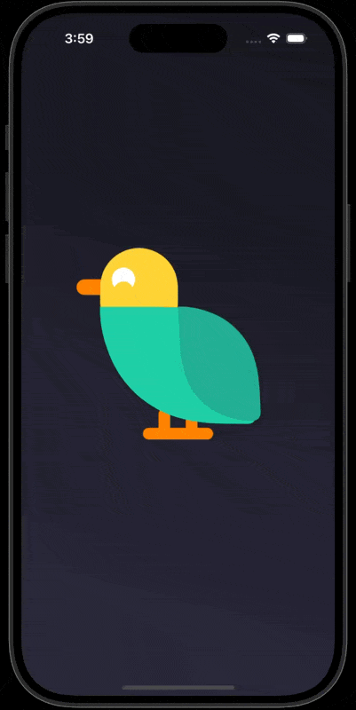
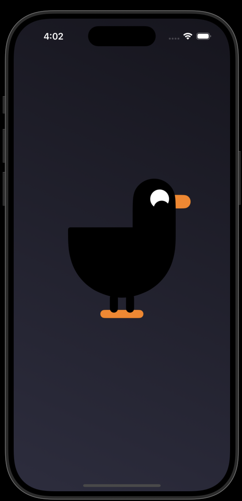

<h1> SwiftUI Experiments
  
</h1>

    
    

### Motivation

I like to play around with SwiftUI and it is fun exploring this framework.
SwiftUI makes it easy to do animations and the results are impressive. As I learn more about it, I try to make something pleasing while covering some of the concepts of SwiftUI.

This repository will contain my experiments with SwiftUI.

## Space Travel: Journey to Earth

I have been playing with Shapes, Animations and Transitions in SwiftUI and decided to make a short animation clip inspried by [Kurzgesagt – In a Nutshell](https://www.youtube.com/channel/UCsXVk37bltHxD1rDPwtNM8Q) YouTube videos.
Starting with combining various Shapes, I created Planets and Birds and then from animating them individually to combining everything together I was able to create a short animation. 

The following animation is combination of Outer Space objects and some Bird Characters, everything is SwiftUI view, no Images used.

### Planets and Stars
 

    
    
    
    

 

### Birds
 

    
    
    
    

 

### Combining everything together
 

    

 

## Try it yourself
1. Clone this repository to your local machine.
2. Open the project in Xcode.
3. Run the app on the simulator or a physical device.
